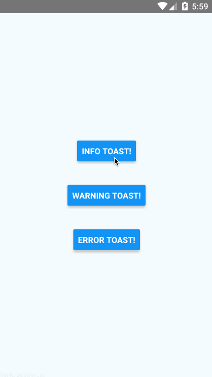
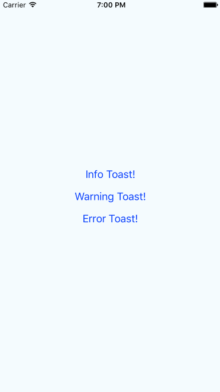

React Native Redux Toast
==================

## Features

- Cross platform.
- Triggered dispatching redux actions
- 100% written in js. No need to link native dependencies
- Easy to customize

Android | iOS
:-------------------------:|:-------------------------:
  |  

## Installation

#### npm
```bash
npm install --save react-native-redux-toast
```

#### yarn
```bash
yarn add react-native-redux-toast
```

## Usage

1- Add the toast reducer to your store

```js
import { createStore, combineReducers } from 'redux';
import { toastReducer as toast } from 'react-native-redux-toast';

const reducers = combineReducers({
  toast
});

export default createStore(reducers);
```

2- Mount the toast component where you want to use it. (Usually at the root level of the app)

```js
import React from 'react';
import { Provider } from 'react-redux';
import { View } from 'react-native';
import { Toast } from 'react-native-redux-toast';

import store from './store';
import App from './app';

export default function main() {
  return (
    <Provider store={store}>
      <View style={{ flex: 1 }}>
        <App />
        <Toast messageStyle={{ color: 'white' }} />
      </View>
    </Provider>
  );
}

```

3- Dispatch actions

```js
class App extends Component {
  displayErrorToast = () => {
    this.props.dispatch(ToastActionsCreators.displayError('Error toast!'));
  };

  displayWarningToast = () => {
    this.props.dispatch(ToastActionsCreators.displayWarning('Warning toast!', 2000));
  };

  displayInfoToast = () => {
    this.props.dispatch(ToastActionsCreators.displayInfo('Info toast!', 5000));
  };

  render() {
    return (
      <View>
        <Button title={'Info Toast!'} onPress={this.displayInfoToast} />
        <Button title={'Warning Toast!'} onPress={this.displayWarningToast} />
        <Button title={'Error Toast!'} onPress={this.displayErrorToast} />
      </View>
    );
  }
}

```

## API

#### Props

- **containerStyle:** (View.propTypes.style) Styles to apply to the View that wraps the Toast

- **messageStyle:** (Text.propTypes.style)
Styles to apply to the Text component of the Toast

- **errorStyle:** (View.propTypes.style)
Same as containerStyle, only applied when the error Toast is being used

- **warningStyle:** (View.propTypes.style)
Same as containerStyle, only applied when the warning Toast is being used

- **getMessageComponent:** (React.PropTypes.func)
Function that returns a component to be used inside the Toast. Receives two params: message and an object: { error: bool, warning: bool }.
Default value:
```js
Toast.defaultProps = {
  getMessageComponent(message) {
    return (
      <Text style={this.messageStyle}>
        {message}
      </Text>
    );
  }
};
```

## Contributing

1. Fork it
2. Create your feature branch (`git checkout -b my-new-feature`)
3. Commit your changes (`git commit -am 'Add some feature'`)
4. Push to the branch (`git push origin my-new-feature`)
5. Create new Pull Request

## About

This project is maintained by [Sebastian Balay](https://github.com/sbalay) and it was written by [Wolox](http://www.wolox.com.ar).


## License

**react-native-redux-toast** is available under the MIT [license](LICENSE).

    Copyright (c) 2017 Sebastián Balay <sebastian.balay@wolox.com.ar>

    Permission is hereby granted, free of charge, to any person obtaining a copy
    of this software and associated documentation files (the "Software"), to deal
    in the Software without restriction, including without limitation the rights
    to use, copy, modify, merge, publish, distribute, sublicense, and/or sell
    copies of the Software, and to permit persons to whom the Software is
    furnished to do so, subject to the following conditions:

    The above copyright notice and this permission notice shall be included in
    all copies or substantial portions of the Software.

    THE SOFTWARE IS PROVIDED "AS IS", WITHOUT WARRANTY OF ANY KIND, EXPRESS OR
    IMPLIED, INCLUDING BUT NOT LIMITED TO THE WARRANTIES OF MERCHANTABILITY,
    FITNESS FOR A PARTICULAR PURPOSE AND NONINFRINGEMENT. IN NO EVENT SHALL THE
    AUTHORS OR COPYRIGHT HOLDERS BE LIABLE FOR ANY CLAIM, DAMAGES OR OTHER
    LIABILITY, WHETHER IN AN ACTION OF CONTRACT, TORT OR OTHERWISE, ARISING FROM,
    OUT OF OR IN CONNECTION WITH THE SOFTWARE OR THE USE OR OTHER DEALINGS IN
    THE SOFTWARE.
